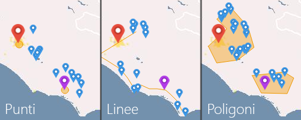

SQL Server Spatial Types Demo
=============================

Un'applicazione ASP.NET MVC 5 che dimostra l'utilizzo degli Spatial Types per trovare risultati con ricerche geografiche.
Tracciando punti, linee e poligoni e' possibile ottenere i risultati che si trovano nei pressi (o all'interno) delle forme tracciate.

Avvio dell'applicazione
-----------------------
E' sufficiente lanciare l'applicazione in Debug da Visual Studio 2015. Potrebbe verificarsi un breve periodo di attesa dovuto alla creazione e al popolamento del database.
In caso di errore di connessione all'instanza di LocalDB, controlla la correttezza della connection string nel web.config ed eventualmente adegua il nome della tua istanza locale di Sql Server.

Codice
------
Le parti "interessanti" si trovano nell'HomeController, che contiene le due action *Distanza* e *Intersezione* usate dall'esempio. L'applicazione usa Entity Framework 6 come tecnologia ORM per l'accesso al database. Entity Framework supporta gli Spatial Types a partire dalla versione 5.

Nella view *Views/Home/Index*, invece, e' presente il codice javascript necessario all'interazione con la mappa, che produce anche le stringhe Well-Known Text inviate al server mediante richieste ajax. La demo e' basata sull'[OpenLayer Draw Feature Example](http://dev.openlayers.org/examples/draw-feature.html).

